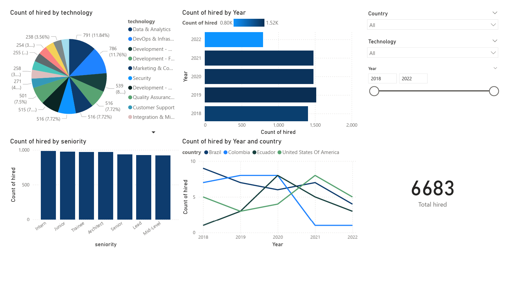

# ETL Workshop 001: Data Engineering Challenge

This project implements an ETL (Extract, Transform, Load) pipeline to process candidate data from a CSV file, store it in a PostgreSQL database, and create visualizations using Power BI. The goal is to analyze hiring trends based on candidate profiles and scores.

## Project Structure

- data/: Contains the candidates.csv dataset.
- notebooks/: Jupyter notebooks for each ETL step:
  - 01_extract_load.ipynb: Loads raw data into PostgreSQL.
  - 02_explore_data.ipynb: Performs exploratory data analysis (EDA).
  - 03_transform_data.ipynb: Transforms data and creates the final table.
- scripts/: Utility scripts like setup.py for database configuration.
- visualizations/: Stores the Power BI dashboard and related files.

## Technologies

- Python
- Jupyter Notebook
- PostgreSQL
- Pandas, Matplotlib, Seaborn
- Power BI

## Installation

1. **Clone the repository and navigate into the project directory:**
   - git clone <https://github.com/jpgomezv/ETL_Workshop_001.git>
   - cd ETL_Workshop_001

2. **Create and activate a virtual environment:**
   - Create the virtual environment: python -m venv venv
   - Activate it:
     - For Windows: venv\Scripts\activate
     - For macOS/Linux: source venv/bin/activate

3. **Install dependencies:**
   - pip install -r requirements.txt

4. **Set up PostgreSQL and create a .env file:**
   - Create a .env file in the root directory with your PostgreSQL credentials:
     - DB_NAME=etl_workshop_db
     - DB_USER=your_user
     - DB_PASSWORD=your_password
     - DB_HOST=localhost
     - DB_PORT=5432

## Usage

- **Database Setup**: The setup.py script creates the database etl_workshop_db and the tables raw_candidates and applicant. This is automatically run in the first notebook.
- **Run the notebooks in order:**
  - notebooks/01_extract_load.ipynb: Extracts data from candidates.csv and loads it into the raw_candidates table.
  - notebooks/02_explore_data.ipynb: Explores the data with visualizations and identifies hiring criteria.
  - notebooks/03_transform_data.ipynb: Transforms the data, applies the hiring rule, and loads it into the applicant table.
- **Open the Power BI dashboard**: Use visualizations/dashboard_workshop.pbix to explore the visualizations.

## Visualizations

The final analysis is presented in a Power BI dashboard, including:

- Distribution of hired candidates by technology (Pie Chart).
- Hires by year (Horizontal Bar Chart).
- Hires by seniority (Bar Chart).
- Hiring trends by country over years (Multiline Chart).

